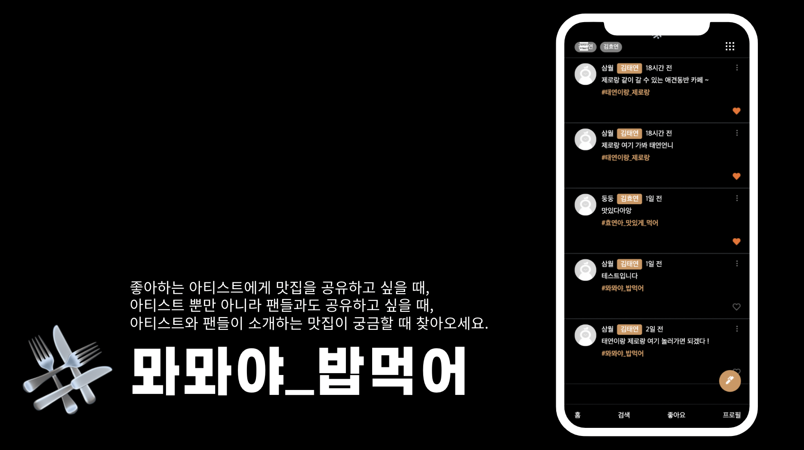
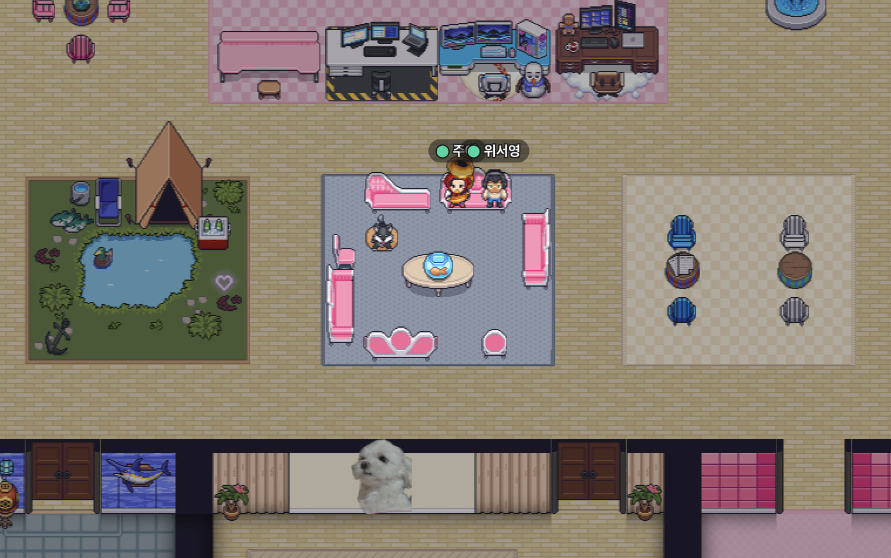
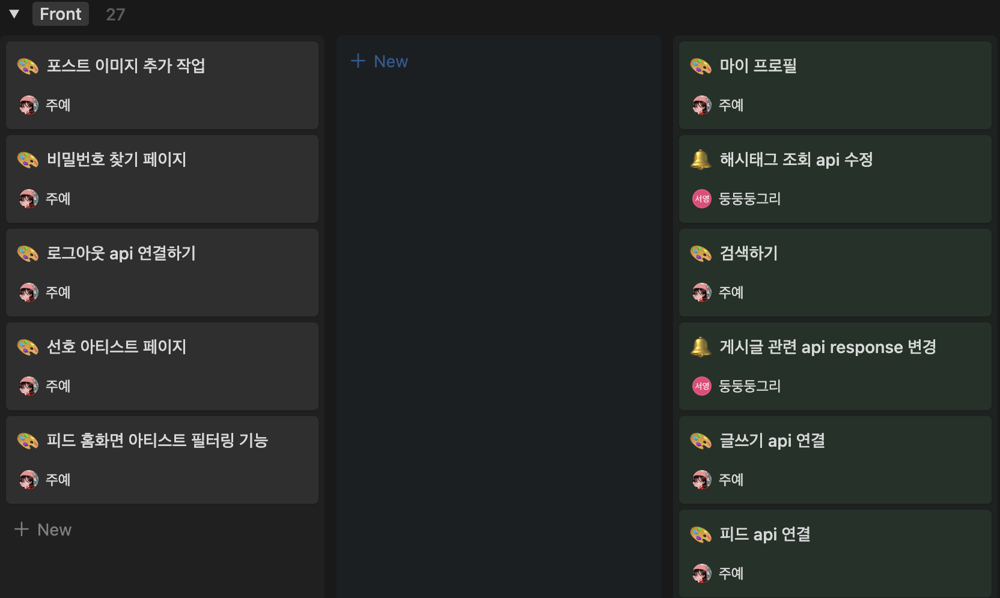
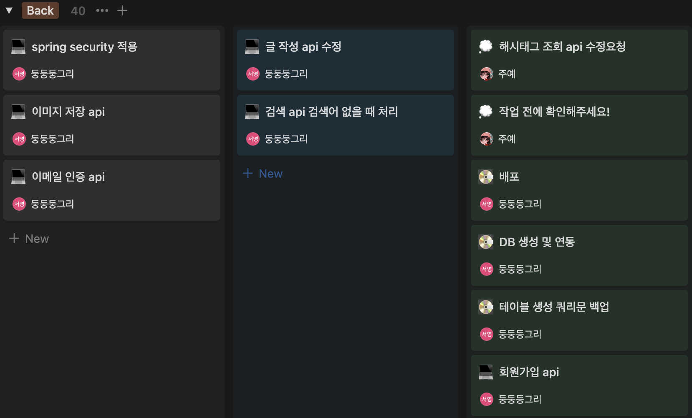

<div align="center">
    
    <h1>#뫄뫄야_밥먹어</h1>
</div>

<div align="center">

좋아하는 아티스트에게 <strong>해시태그</strong>를 사용해 맛집을 공유하세요.
</div>

<div align="center">


</div>

<div align="center" style="background-color: gray;margin-top: 12px">
</div>

## 1. 서비스 소개

<p>
트위터에서 자주 사용하는 <strong>해시태그</strong>를 사용한 맛집소개를 시작으로 <br />
좋아하는 아티스트에게 맛집을 소개하는 <strong>해시태그</strong>와 함께 글을 남겨 맛집을 소개하고,<br /> 다른 <strong>해시태그</strong>들을 검색할 수 있습니다.
</p>

## 2. 팀원 소개

```
안녕하세요. #뫄뫄야_밥먹자 프로젝트를 진행한 서윗한 독서실 모임 입니다.
저희는 게더타운에 모여, 각자 자율적으로 공부하며,
공부한 내용을 프로젝트에 직접 적용해보기 위해 #뫄뫄야_밥먹자 프로젝트를 진행했습니다.
1명의 프론트엔드 개발자와 1명의 백엔드 개발자가 참여하였습니다.
```

<div align="center">

|                                                                                                  |                         |
| :-------------------------------------------------------------------------------------------------------------------------------------------------------: | :-----------------------------------------------------------------------------: |
|  |  |
|                                                          [🐈‍⬛서주예](https://github.com/samweol)                                                           |                     [🐅위서영](https://github.com/katewee)                      |

</div>

## 3. 개발

### 3-1 개발 일정

```
개발 일정 : 2023. 12 ~ 2024. 02. 18
1차 회의 : 2023. 12. 11
1차 중간점검 : 2024. 01. 24
2차 중간점검 : 2024. 02. 07
프로젝트 마감 : 2024. 02. 18
리드미 작성 : 2024. 02. 20
리팩토링 : 2024. 02. 21 ~
```

### 3-2 개발 및 협업

- 게더타운에서 회의 및 개발 진행
  
- 노션으로 프로젝트 관리
  
  
- 노션으로 문서 관리
  

## 4. 기술스택

| Front                 | Back                      |
| --------------------- | ------------------------- |
| - JS + React + Vite   | - Java                    |
| - Sass                | - MySQL                   |
| - Recoil              | - Spring Boot             |
| - React-router, Axios | - Naver Clouding Platform |

## 5. 주요기능 소개

### 5.1 로그인, 로그아웃 및 회원가입

#### 5.1.1 로그인, 로그아웃

| 로그인 | 로그아웃 |
| ------ | -------- |
|        |          |

#### 5.1.2 회원가입

| 이메일 중복 검사 | 선호 아티스트 선택 |
| ---------------- | ------------------ |
|                  |                    |

### 5.2 해시태그 랭킹 조회 및 검색

| 키워드 검색 | 랭킹 검색 | 게시글 검색 |
| ----------- | --------- | ----------- |
|             |           |             |

### 5.3 게시글 좋아요

| 게시글 좋아요 |
| ------------- |
|               |

### 5.4 게시글 작성, 삭제 및 신고

| 게시글 작성 | 게시글 삭제 | 게시글 신고 |
| ----------- | ----------- | ----------- |
|             |             |             |

### 5.5 유저 프로필 및 수정

| 프로필 | 프로필 수정 |
| ------ | ----------- |
|        |             |

## 6. 핵심코드

### Front

#### **6-1 useDebounce 사용**

먼저 **Debounce** 란, 이벤트를 그룹화하여 특정시간이 지난 후 하나의 이벤트만 발생하도록 하는 기술로, 순차적 호출을 하나의 그룹으로 "그룹화"할 수 있다.

전체적으로 검색 키워드로 api를 호출해야하는 input의 경우 debounce를 사용하였다. 그 이유는 사용자의 입력, 즉 state 값이 변경될 때 마다 api를 호출하는 것을 방지하기 위해서이다.

debounce의 경우 검색 페이지, 아티스트 검색, 해시태그 조회 및 다양한 페이지에서 사용될 것으로 예상되어 hooks로 작성했다.

```jsx
import { useEffect, useRef } from "react";

export default function useDebounce() {
  const timer = useRef(null);

  const debounce = (callback, time) => {
    if (timer.current) clearTimeout(timer.current);
    timer.current = setTimeout(() => {
      callback();
      timer.current = null;
    }, time);
  };

  useEffect(() => {
    return () => {
      if (timer.current) clearTimeout(timer);
    };
  });

  return { debounce };
}
```

지연 시간과 callback 함수를 인자로 받아 범용성을 올렸다.
`setTimeout` 를 활용해 지연시간을 설정해주고, 해당 지연시간이 지난 후 인자로 받은 `callback` 함수가 실행되게하여 디바운스를 구현했다.

### Back

#### **6-2 Spring Data JPA를 이용한 DB 조작**

JPA는 객체와 관계형 데이터베이스의 데이터를 매핑한다. 테이블에 대응되는 entity 객체를 만들면 JPA는 이 객체를 분석해서 sql문을 자동으로 생성하여 DB를 조작하므로 직접 sql문을 작성하지 않고도 데이터의 CRUD가 가능하다.
이 프로젝트에서는 Spring Data JPA에서 제공하는 `JPARepository`를 사용하여 `EntityManage`r를 별도로 설정하지 않고 JPA를 사용했다. 또한 `JPARepository`에는 `save()`, `findById()` 등의 기본적인 저장, 조회에 대한 메소드가 구현되어 있어서 반복적인 코드 작성을 피할 수 있었다.

```java
//DB의 사용자 정보 테이블에 대응되는 Member Entity

@Entity
@Table(name = "users")
public class Member{

    @Id
    @GeneratedValue(strategy = GenerationType.IDENTITY)
    @Column(name = "UID")
    private long uid;
    private String nickname;
    private String email;
    private String pw;
    private String bio;
    private String role;

}
```

```java
//Member entity를 이용하여 사용자 정보 테이블을 조작하는 MemberRepository

import com.mwamwayababmeokuh.mwamwa.domain.Member;
import org.springframework.data.jpa.repository.JpaRepository;

import java.util.Optional;

public interface MemberRepository extends JpaRepository<Member, Long> {

    Optional<Member> findByEmail(String searchKeyword);
    Optional<Member> findByEmailAndPw(String email, String pw);
}
```

테이블의 기본키가 아닌 이메일이나 비밀번호 등의 값으로 사용자를 조회하고자 할 때는 `findBy{컬럼이름}`으로 메소드 이름을 작성했다. 이 규칙에 따라서 메소드 이름을 작성하면 JPA가 해당 컬럼 값으로 데이터를 조회하는 쿼리문을 생성하므로 함수를 구현하지 않고도 데이터를 조회할 수 있다.

#### **6-3 더티 체킹을 통한 데이터 업데이트**

사용자나 게시글 등의 데이터를 업데이트해야 하는데 JPA에서는 업데이트 메소드를 지원하지 않으므로 더티 체킹 방식으로 DB에 변경 사항을 반영했다.

```java
@Service
@Slf4j
@Transactional
public class BoardService {

    @Autowired
    BoardRepository boardRepository;
    private final ModelMapper modelMapper = new ModelMapper();

    ...

    public PostDTO update(PostDTO postDTO) {
        log.info("update()" + postDTO.toString());
        Optional<Post> optionalPost = boardRepository.findById(postDTO.getPid());
        Post post = optionalPost.orElseThrow(NoSuchElementException::new);
        post.setAid(postDTO.getAid());
        post.setHashtag(postDTO.getHashtag());
        post.setContent(postDTO.getContent());
        post.setLng(postDTO.getLng());
        post.setLat(postDTO.getLat());
        return modelMapper.map(post, PostDTO.class);
    }

		...
}
```

위의 코드는 게시글 수정을 담당하는 update 메소드를 구현한 코드이다. 우선 게시글의 아이디를 이용해서 수정할 게시글을 검색하여 entity 객체를 생성했다. 그리고 setter를 이용해서 entity의 값을 전달 받은 값으로 변경했다. 변경된 값을 modelMapper를 이용해서 DTO 객체로 변환하여 반환하고 함수는 종료된다. `@Transactional` 어노테이션에 의해서 이 함수에는 트랜잭션이 적용되어 있으므로 함수가 종료된 후에 변경 사항이 데이터베이스에 반영된다.

## 7. 트러블 슈팅

### Front

#### **7-1 vite에서 env 파일 사용하기**

<a href="https://ko.vitejs.dev/guide/env-and-mode.html">vite env 환경변수</a>

<p>
기존에 진행한 프로젝트는 CRA를 사용해 webpack 이였지만, 이번 프로젝트는 vite를 사용하였기때문에 env 파일 사용하는 방법이 달랐다. <br /> 1.루트 폴더 위에 .env를 생성한다. <br /> 2. VITE_라는 접두사를 붙여 변수를 생성한다. <br /> 3. import.meta.env 로 접근한다.
</p>
<br />

#### **7-2 axios get 요청에서 params 넘기기**

<p>
get 요청 API의 경우 일반적으로 url 뒤에 파라미터 값을 붙여서 넘긴다.
우리 프로젝트의 코드로 예시를 들자면,
</p>
<code>
`/check-email?email=${userData.email}`
</code>
처럼 파라미터로 email 값을 보냈다. <br />
<p>
하지만 get 요청에서는 파라미터를 보낼 수 있는 방법이 1. 패스 배리어블과 2. 리퀘스트 파라미터에 담아서 보내는 방법이 있었다.<br />
처음에 이 둘을 구분하지 못하고 패스 배리어블, 즉 url에 파라미터를 담아 보내는 식으로 코드를 작성하자 서버에서 값을 받지못했다고 했다. <br />
</p>
<p>프로젝트에선 <strong>axios</strong>를 사용하여 통신하였기때문에 이를 기반으로 코드를 수정했다.</p>

```jsx
await api.get("/boards/posts/like", {
  params: {
    uid: user.uid,
    pid: post.pid,
  },
});
```

### Back

#### **7-3 Spring Boot 3.x 버전에서 JPA가 적용되지 않는 문제**

초기 개발 환경을 Spring Boot 3.2.2로 설정하고 JPA Gradle을 적용했는데 프로젝트를 실행해보니 'Cannot resolve symbol...' 이라는 오류가 계속 발생했다. 관련 패키지를 사용하는 과정에서 제대로 import가 이루어지지 않아서 발생하는 문제인 듯하여 다음과 같은 방법을 시도했다.

1. IntelliJ의 Gradle 빌드 설정을 IntelliJ IDEA로 변경한다.
2. 프로젝트를 다시 빌드한다.
3. IDE를 최신 버전으로 업데이트한다.
4. Spring Boot의 버전을 2.7.5 버전으로 낮추고 javax.persistence.\*을 import 한다.

1, 2, 3번의 방법으로는 문제가 해결되지 않았고 4번 방법으로 문제를 해결할 수 있었다.

#### **7-4 entity에 없는 컬럼의 데이터 받아오기**

테이블을 join해서 데이터를 받을 때 entity에 대응하는 필드가 없는 컬럼의 데이터를 가져오려고 하니 오류가 발생했다. 해당 컬럼을 외래키로 설정해서 테이블에 컬럼을 추가하고 entity에 필드를 선언해서 문제를 해결하려고 했으나, 해당 컬럼의 값이 Unique 하지 않아서 외래키로 지정하는 것이 어려웠다.
테이블에는 없는 컬럼을 entity에 추가하면 마찬가지로 오류가 발생해서 이런 쿼리를 수행할 때는 entity가 아닌 DTO로 데이터를 바로 받도록 코드를 작성했다.

```java
//jpql 예시
@Query("select new com.mwamwayababmeokuh.mwamwa.domain" +
            ".PostDTO(p.pid, p.aid, a.name, p.hashtag, p.content, p.lat, p.lng, p.writer, m.nickname, p.createdAt) " +
            "from Post p " +
            "join Artist a on p.aid = a.aid " +
            "join Member m on p.writer = m.uid " +
            "where p.writer = :uid order by p.createdAt desc")
List<PostDTO> findAllByWriterOrderByCreatedAtDesc(@Param(value = "uid") long uid);
```

#### **7-5 CORS 오류**

구현해 놓은 api를 프론트에서 호출하는 과정에서 CORS 오류가 발생했다. 이 오류는 동일한 출처의 리소스에만 접근하도록 제한하는 동일 출처 정책을 위반해서 발생하는 오류였다. 문제를 해결하기 위해서 프론트에게 접근 권한을 부여하는 WebConfig 파일을 작성했다.

```java
@Configuration
public class WebConfig implements WebMvcConfigurer {

    @Override
    public void addCorsMappings(CorsRegistry registry) {
        registry.addMapping("/**")
                .allowedOrigins("*")
                .allowedMethods("GET", "POST", "PUT", "DELETE", "PATCH", "OPTIONS");
    }
}
```

`addMapping()`은 CORS를 적용할 url 패턴을 정의한다. 여기서는 와일드 카드를 사용해서 모든 패턴에 CORS를 적용하도록 했다.
`allowedOrigins()`는 자원 공유를 허용할 origin을 지정한다. “_”을 사용해서 모든 origin에 대해 공유를 허용했다.
`allowedMethods()`는 허용할 http method를 지정한다. 마찬가지로 “_”을 사용하면 모든 method를 허용할 수 있지만 실제로 “\*”을 작성하고 api를 호출하니 CORS 오류가 해결되지 않아서 직접 method를 작성했다.

## 8.느낀점

<p>
    [Front] 서주예 : 항상 준비되어있는 API를 사용했던 프로젝트와는 다르게 성장해가는 개발자 둘이서 진행하면서 수많은 에러를 만났다. 하지만 그를 통해 협업하면서 발생할 수 있는 다양한 문제들을 미리 겪어보고 해결해나갈 수 있어서 좋았다. 시간에 쫓겨 새로운 라이브러리 대신 익숙한 라이브러리를 사용하였지만, 리팩토링을 통해 새로 공부한 라이브러리를 도입하고, 중구난방하게 존재하는 중복코드를 줄이는 식으로 진행할 것이다.
</p>
<p>
    [Back] 위서영 : 처음으로 프론트와 하는 협업이라서 만들어둔 api를 프론트에서 적용할 때 많은 오류가 발생했다. API 명세서 작성 단계에서 프론트와 상의하여 request, response를 같이 정의하는 과정의 중요성을 느꼈다. 또한 이번 프로젝트를 진행하면서 JPA를 공부해서 적용했는데 JPA에 대한 지식이 부족한 상태에서 사용하다 보니 초반에 오류가 많았다. 결국 오류는 해결했지만 JPA를 더 효율적으로 활용하는 방식으로 프로젝트를 수정해나가려고 한다.
</p>

## 9.리팩토링

### Front

- recoil 라이브러리 redux로 변경하기
- modal창 `createPortal` 사용해서 다시 만들기
- 중복코드 줄이기
- 변수명 통일 및 명확하게 수정하기
- 추가개발 (선호 아티스트 수정, 게시글에 이미지 업로드)
- 반응형 화면 제작(모니터 일 경우 화면 두개로 분리)

### Back

- 테이블을 조인할 때 JPA의 조인 기능을 이용하도록 수정
- sql을 이용하여 작성한 쿼리를 jpql로 변경
- 게시글 좋아요 정보를 저장하는 테이블에 중복값 저장 방지
- 글 작성 시 해시태그 복수 입력 가능하도록 수정
- 기능 추가 (이미지 저장, 글 조회 시 페이징 적용 등)
- ssl 인증서 발급 및 https 통신 적용
- 로그인 api에서 jwt를 활용하도록 수정하여 보안 강화
- Hibernate가 생성한 쿼리 확인 및 비효율적인 쿼리 개선
