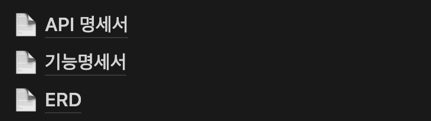

<div align="center">
    
    <h1>#뫄뫄야_밥먹어</h1>
</div>

<div align="center">

좋아하는 아티스트에게 <strong>해시태그</strong>를 사용해 맛집을 공유하세요.
</div>

<div align="center">


</div>

<div align="center" style="background-color: gray;margin-top: 12px">
</div>

## 1. 서비스 소개

<p>
트위터에서 자주 사용하는 <strong>해시태그</strong>를 사용한 맛집소개를 시작으로 <br />
좋아하는 아티스트에게 맛집을 소개하는 <strong>해시태그</strong>와 함께 글을 남겨 맛집을 소개하고,<br /> 다른 <strong>해시태그</strong>들을 검색할 수 있습니다.
</p>

## 2. 팀원 소개

```
안녕하세요. #뫄뫄야_밥먹자 프로젝트를 진행한 서윗한 독서실 모임 입니다.
저희는 게더타운에 모여, 각자 자율적으로 공부하며,
공부한 내용을 프로젝트에 직접 적용해보기 위해 #뫄뫄야_밥먹자 프로젝트를 진행했습니다.
1명의 프론트엔드 개발자와 1명의 백엔드 개발자가 참여하였습니다.
```

<div align="center">

|                                                                                                  |                         |
| :-------------------------------------------------------------------------------------------------------------------------------------------------------: | :-----------------------------------------------------------------------------: |
|  |  |
|                                                          [🐈‍⬛서주예](https://github.com/samweol)                                                           |                     [🐅위서영](https://github.com/katewee)                      |

</div>

## 3. 개발

### 3-1 개발 일정

```
개발 일정 : 2023. 12 ~ 2024. 02. 18
1차 회의 : 2023. 12. 11
1차 중간점검 : 2024. 01. 24
2차 중간점검 : 2024. 02. 07
프로젝트 마감 : 2024. 02. 18
리드미 작성 : 2024. 02. 20
리팩토링 : 2024. 02. 21 ~
```

### 3-2 개발 및 협업

- 게더타운에서 회의 및 개발 진행
  
- 노션으로 프로젝트 관리
  
  
- 노션으로 문서 관리
  

## 4. 기술스택

| Front                 | Back                      |
| --------------------- | ------------------------- |
| - JS + React + Vite   | - Java                    |
| - Sass                | - MySQL                   |
| - Recoil              | - Spring Boot             |
| - React-router, Axios | - Naver Clouding Platform |

## 5. 주요기능 소개

### 5.1 로그인, 로그아웃 및 회원가입

#### 5.1.1 로그인, 로그아웃

| 로그인 | 로그아웃 |
| ------ | -------- |
|        |          |

#### 5.1.2 회원가입

| 이메일 중복 검사 | 선호 아티스트 선택 |
| ---------------- | ------------------ |
|                  |                    |

### 5.2 해시태그 랭킹 조회 및 검색

| 키워드 검색 | 랭킹 검색 | 게시글 검색 |
| ----------- | --------- | ----------- |
|             |           |             |

### 5.3 게시글 좋아요

| 게시글 좋아요 |
| ------------- |
|               |

### 5.4 게시글 작성, 삭제 및 신고

| 게시글 작성 | 게시글 삭제 | 게시글 신고 |
| ----------- | ----------- | ----------- |
|             |             |             |

### 5.5 유저 프로필 및 수정

| 프로필 | 프로필 수정 |
| ------ | ----------- |
|        |             |

## 6. 핵심코드

### Front

#### **6-1 useDebounce 사용**

먼저 **Debounce** 란, 이벤트를 그룹화하여 특정시간이 지난 후 하나의 이벤트만 발생하도록 하는 기술로, 순차적 호출을 하나의 그룹으로 "그룹화"할 수 있다.

전체적으로 검색 키워드로 api를 호출해야하는 input의 경우 debounce를 사용하였다. 그 이유는 사용자의 입력, 즉 state 값이 변경될 때 마다 api를 호출하는 것을 방지하기 위해서이다.

debounce의 경우 검색 페이지, 아티스트 검색, 해시태그 조회 및 다양한 페이지에서 사용될 것으로 예상되어 hooks로 작성했다.

```jsx
import { useEffect, useRef } from "react";

export default function useDebounce() {
  const timer = useRef(null);

  const debounce = (callback, time) => {
    if (timer.current) clearTimeout(timer.current);
    timer.current = setTimeout(() => {
      callback();
      timer.current = null;
    }, time);
  };

  useEffect(() => {
    return () => {
      if (timer.current) clearTimeout(timer);
    };
  });

  return { debounce };
}
```

지연 시간과 callback 함수를 인자로 받아 범용성을 올렸다.
`setTimeout` 를 활용해 지연시간을 설정해주고, 해당 지연시간이 지난 후 인자로 받은 `callback` 함수가 실행되게하여 디바운스를 구현했다.

### Back

## 7. 트러블 슈팅

### Front

#### **7-1 vite에서 env 파일 사용하기**

<a href="https://ko.vitejs.dev/guide/env-and-mode.html">vite env 환경변수</a>

<p>
기존에 진행한 프로젝트는 CRA를 사용해 webpack 이였지만, 이번 프로젝트는 vite를 사용하였기때문에 env 파일 사용하는 방법이 달랐다. <br /> 1.루트 폴더 위에 .env를 생성한다. <br /> 2. VITE_라는 접두사를 붙여 변수를 생성한다. <br /> 3. import.meta.env 로 접근한다.
</p>
<br />

#### **7-2 axios get 요청에서 params 넘기기**

<p>
get 요청 API의 경우 일반적으로 url 뒤에 파라미터 값을 붙여서 넘긴다.
우리 프로젝트의 코드로 예시를 들자면,
</p>
<code>
`/check-email?email=${userData.email}`
</code>
처럼 파라미터로 email 값을 보냈다. <br />
<p>
하지만 get 요청에서는 파라미터를 보낼 수 있는 방법이 1. 패스 배리어블과 2. 리퀘스트 파라미터에 담아서 보내는 방법이 있었다.<br />
처음에 이 둘을 구분하지 못하고 패스 배리어블, 즉 url에 파라미터를 담아 보내는 식으로 코드를 작성하자 서버에서 값을 받지못했다고 했다. <br />
</p>
<p>프로젝트에선 <strong>axios</strong>를 사용하여 통신하였기때문에 이를 기반으로 코드를 수정했다.</p>

```jsx
await api.get("/boards/posts/like", {
  params: {
    uid: user.uid,
    pid: post.pid,
  },
});
```

### Back

## 8.느낀점

<p>
    [Front] 서주예 : 항상 준비되어있는 API를 사용했던 프로젝트와는 다르게 성장해가는 개발자 둘이서 진행하면서 수많은 에러를 만났다. 하지만 그를 통해 협업하면서 발생할 수 있는 다양한 문제들을 미리 겪어보고 해결해나갈 수 있어서 좋았다. 시간에 쫓겨 새로운 라이브러리 대신 익숙한 라이브러리를 사용하였지만, 리팩토링을 통해 새로 공부한 라이브러리를 도입하고, 중구난방하게 존재하는 중복코드를 줄이는 식으로 진행할 것이다.
</p>
<p>
    [Back] 위서영 : 
</p>

## 9.리팩토링

### Front

- recoil 라이브러리 redux로 변경하기
- modal창 `createPortal` 사용해서 다시 만들기
- 중복코드 줄이기
- 변수명 통일 및 명확하게 수정하기
- 추가개발 (선호 아티스트 수정, 게시글에 이미지 업로드)
- 반응형 화면 제작(모니터 일 경우 화면 두개로 분리)

### Back
